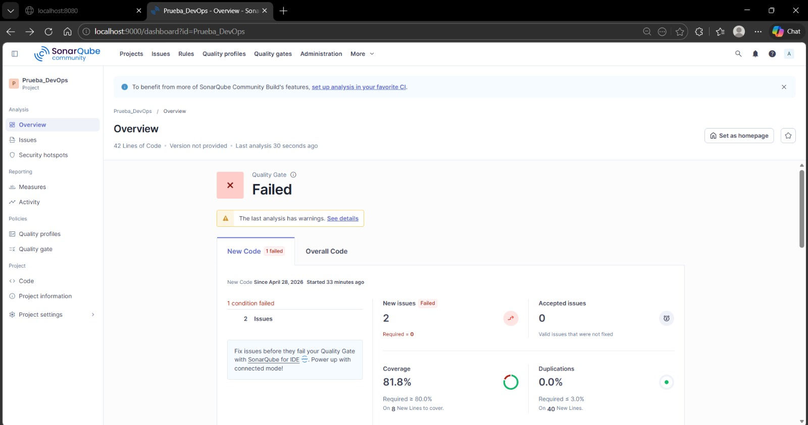
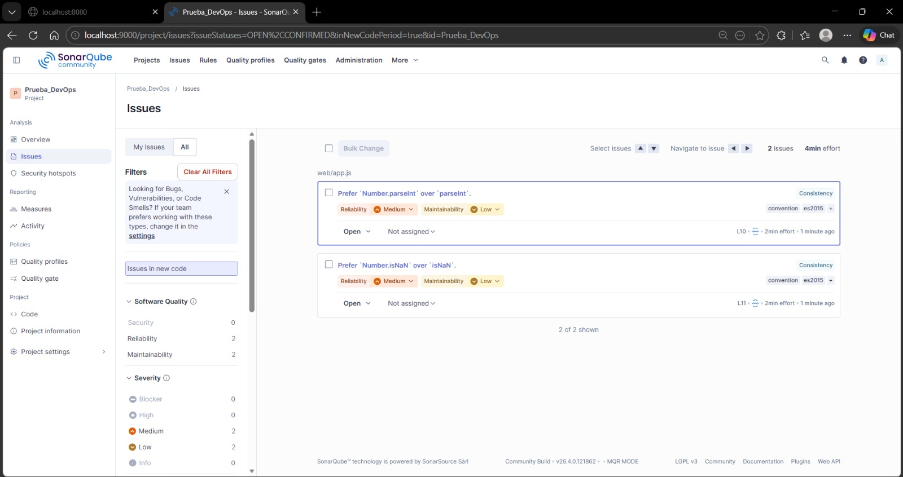
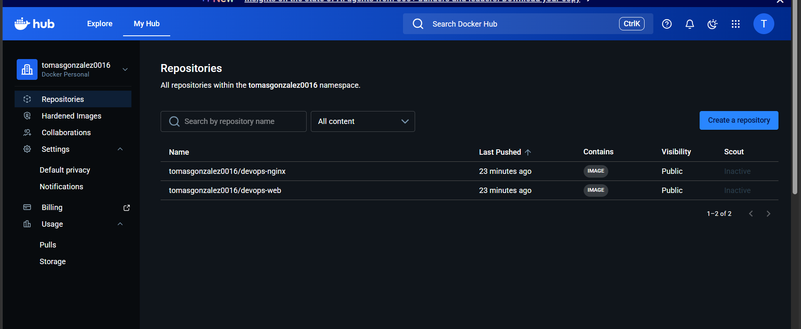
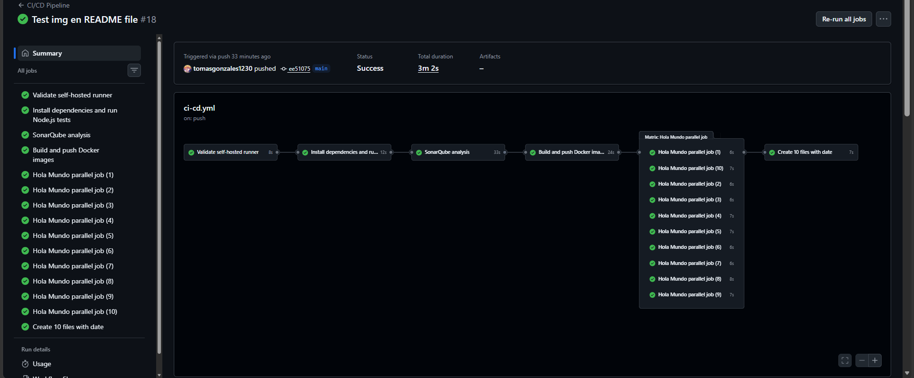
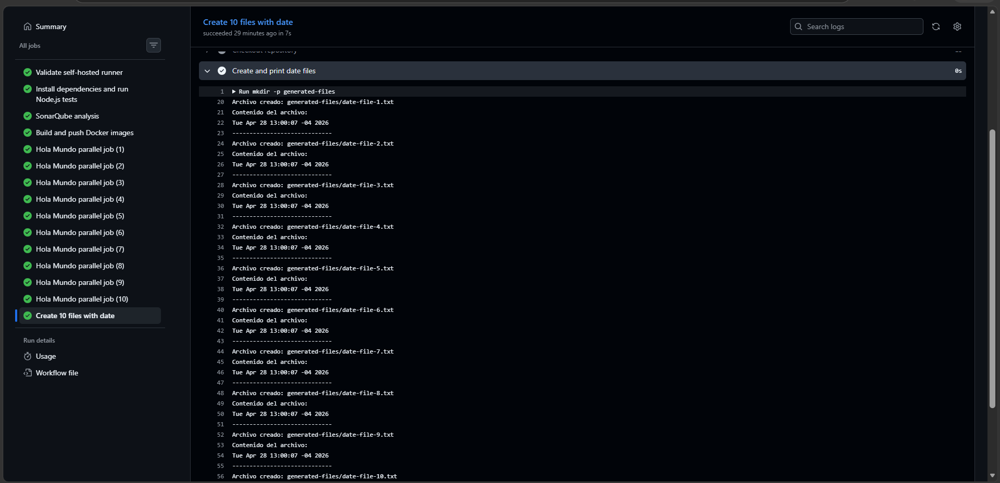
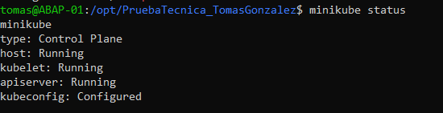
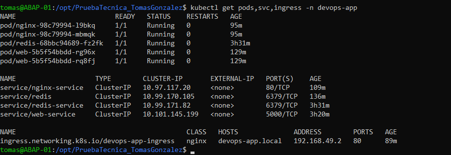
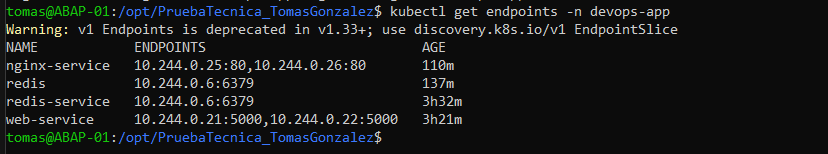
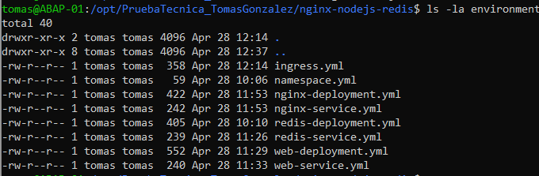
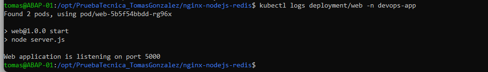

## Prueba Tecnica Devops


## Node.js application with Nginx proxy and Redis database

Project structure:
```
.
└── nginx-nodejs-redis
    ├── README.md
    ├── compose.yaml
    ├── docs
    │   └── img
    ├── environment
    │   ├── ingress.yml
    │   ├── namespace.yml
    │   ├── nginx-deployment.yml
    │   ├── nginx-service.yml
    │   ├── redis-deployment.yml
    │   ├── redis-service.yml
    │   ├── web-deployment.yml
    │   └── web-service.yml
    ├── nginx
    │   ├── Dockerfile
    │   └── nginx.conf
    ├── package-lock.json
    ├── sonar-project.properties
    └── web
        ├── Dockerfile
        ├── app.js
        ├── app.test.js
        ├── package-lock.json
        ├── package.json
        ├── server.js
        └── server.test.js

```
## Análisis con SonarQube
```
SonarQube fue utilizado para realizar análisis estático de código y validar la calidad de la aplicación Node.js.

Como parte de la prueba técnica, se ejecutaron dos escenarios solicitados:

1. Un escenario con análisis fallido❌.
2. Un escenario con análisis exitoso✅.

## Análisis fallido con SonarQube ❌

Para cumplir con el requerimiento de la prueba técnica, se generó intencionalmente un escenario donde el análisis de SonarQube fallara o reportara issues de calidad sobre el código fuente.

El objetivo de este escenario fue demostrar que SonarQube estaba correctamente configurado y que era capaz de detectar problemas de calidad en el código de la aplicación Node.js.
```

```
Causa de fallo❌

Para provocar el fallo, se modificó el archivo `web/app.js`, eliminando el uso de la clase `Number`.
```


```
Caso exitoso ✅

- se corrigio el fallo para que los test puedan pasar de forma exitosa
```


```javascript
// Código que provocó issues en SonarQube
parseInt()
isNaN()

// Código recomendado por SonarQube
Number.parseInt()
Number.isNaN()

```

## Construcción y publicación de imágenes Docker

El pipeline construye las imágenes Docker de la aplicación y las publica en DockerHub.

Se generaron dos imágenes:

```text
tomasgonzalez0016/devops-web:latest
tomasgonzalez0016/devops-nginx:latest
```


## Scripts ejecutados en el pipeline

Como parte de la prueba técnica, el pipeline ejecuta dos scripts en Bash:

- Impresión de `Hola Mundo` 10 veces usando un job paralelo.
- Creación de 10 archivos con la fecha actual y posterior impresión de su contenido en consola.

### Job paralelo - Hola Mundo y creacion de Files con fecha actual

Se configuró un job paralelo en el pipeline para imprimir el mensaje `Hola Mundo` 10 veces en la consola y crear los 10 archivos con la fecha actual




## Despliegue en Kubernetes

La aplicación fue desplegada en un clúster local de Kubernetes utilizando Minikube.

Los manifiestos utilizados para el despliegue se encuentran en la carpeta:
```text
environment/
```

- ### Evidencia del clúster Minikube


- ### Evidencia de recursos desplegados


- ### Evidencia de endpoints


- ### Archivos YAML de Kubernetes


- ### Logs de la aplicación
